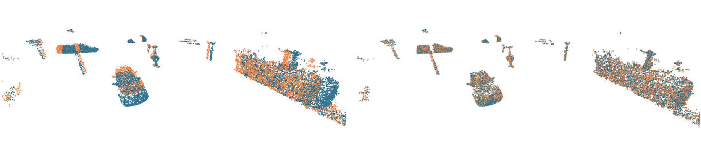

# FLOT: Scene Flow on Point Clouds guided by Optimal Transport



[**FLOT: Scene Flow on Point Clouds guided by Optimal Transport**](https://arxiv.org/abs/2007.11142)  
[*Gilles Puy*<sup>1</sup>](https://sites.google.com/site/puygilles/home),
[*Alexandre Boulch*<sup>1</sup>](http://boulch.eu),
[*Renaud Marlet*<sup>1,2</sup>](http://imagine.enpc.fr/~marletr/)  
<sup>1</sup>*valeo.ai, France and <sup>2</sup>ENPC, France*

If you find this code or work useful, please cite our [paper](https://arxiv.org/abs/2007.11142):
```
@inproceedings{puy20flot,
  title={{FLOT}: {S}cene {F}low on {P}oint {C}louds {G}uided by {O}ptimal {T}ransport},
  author={Puy, Gilles and Boulch, Alexandre and Marlet, Renaud},
  booktitle={European Conference on Computer Vision}
  year={2020}
}
```

## Abstract


## Preparation

### Pre-requisites
* python = 3.7
* pytorch = 1.3.1
* cuda = 10.0
* tqdm
* tensorboard

You can create a conda environment for FLOT by typing: 
```bash
$ conda create --name FLOT
$ conda activate FLOT
$ conda install python=3.7 tqdm tensorboard
$ conda install pytorch=1.3.1 cuda100 torchvision -c pytorch
```

### Installation
1. Clone this repository:
```bash
$ git clone https://github.com/valeoai/FLOT.git
```

2. Install the repository:
```bash
$ pip install -e ./FLOT
```

 You can edit flot's code on the fly and import function and classes of flot in other project as well.

* To uninstall this package, run:
```bash
$ pip uninstall flot
```

### Datasets
By default, the datasets are stored in ```/path/to/flot/data```. The datasets are prepared using FlyingThing3D and the KITTI scene flow dataset. There are two different ways to prepare the datasets.

1. **FlowNet3d's version**: Please download the datasets available [here](https://github.com/xingyul/flownet3d) to obtain the FlyingThings3D and KITTI datasets used in this [paper](https://arxiv.org/abs/1806.01411). These datasets are denoted FT3D<sub>o</sub> and KITTI<sub>o</sub> in our [paper](https://arxiv.org/abs/2007.11142). After downloading the datasets, move them in
```bash
/path/to/flot/data/flownet3d/
```

  Instead of moving the datasets, you can also create a link between the actual dataset location and the folder `/path/to/flot/data/flownet3d/`:
```bash
$ ln -s /path/to/dataset/on/your/sytem /path/to/flot/data/flownet3d/
```

  The directory `/path/to/flot/data/flownet3d/` should have the following sub-directories:
```bash
/path/to/flot/data/flownet3d/data_processed_maxcut_35_20k_2k_8192   % FlyingThings3D dataset
/path/to/flot/data/flownet3d/kitti_rm_ground                        % KITTI dataset
```

2. **HPLFlowNet's version**: Please follow the instructions given [here](https://github.com/laoreja/HPLFlowNet) to construct the FlyingThings3D and KITTI datasets used in this [paper](https://arxiv.org/abs/1906.05332). These datasets are denoted FT3D<sub>s</sub> and KITTI<sub>s</sub> in our [paper](https://arxiv.org/abs/2007.11142). After preparation, move the datasets in
```bash
/path/to/flot/data/HPLFlowNet/
```

  Instead of moving the datasets, you can also create a link between the actual dataset location and the folder `/path/to/flot/data/HPLFlowNet/`:
```bash
$ ln -s /path/to/dataset/on/your/sytem /path/to/flot/data/HPLFlowNet/
```

  The directory `/path/to/flot/data/HPLFlowNet/` should have the following sub-directories:
```bash
/path/to/flot/data/HPLFlowNet/FlyingThings3D_subset_processed_35m   % FlyingThings3D dataset
/path/to/flot/data/HPLFlowNet/KITTI_processed_occ_final             % KITTI dataset         
```

## Running the code

### Testing

* **Quickest test.** Type:
```bash
$ cd /path/to/flot/scripts/
$ python val_test.py
```

  This evaluates the model trained on FT3D<sub>o</sub> and 2048 points available at ```/path/to/flot/pretrained_models/model_2048.tar``` on KITTI<sub>o</sub>.

For help on how to use this script, type:  
```bash
$ cd /path/to/flot/scripts/
$ python val_test.py --help
```
 
1. **FlowNet3d's datasets.** A model trained on FT3D<sub>o</sub> and 2048 points (Sec. 4.5 in our [paper](https://arxiv.org/abs/2007.11142)) is available at ```/path/to/flot/pretrained_models/model_2048.tar```.

  To evaluate this pre-trained model on KITTI<sub>o</sub>, type:
```bash
$ cd /path/to/flot/scripts/
$ python val_test.py --dataset flownet3D_kitti --test --nb_points 2048 --path2ckpt ../pretrained_models/model_2048.tar
```

  To evaluate this pre-trained model on the test set of FT3D<sub>o</sub>, type:
```bash
$ cd /path/to/flot/scripts/
$ python val_test.py --dataset flownet3D_ft3d --test --nb_points 2048 --path2ckpt ../pretrained_models/model_2048.tar
```

2. **HPLFlowNet's datasets.** A model trained on FT3D<sub>s</sub> and 8192 points (Sec. 4.5 in our [paper](https://arxiv.org/abs/2007.11142)) is available at ```/path/to/flot/pretrained_models/model_8192.tar```.

  To evaluate this pretrained model on KITTI<sub>s</sub>, type:
```bash
$ cd /path/to/flot/scripts/
$ python val_test.py --dataset HPLFlowNet_kitti --test --nb_points 8192 --path2ckpt ../pretrained_models/model_8192.tar
```

  To evaluate this pre-trained model on the test set of FT3D<sub>s</sub>, type:
```bash
$ cd /path/to/flot/scripts/
$ python val_test.py --dataset HPLFlowNet_ft3d --test --nb_points 8192 --path2ckpt ../pretrained_models/model_8192.tar
```

### Training
By default, the model and tensorboard's logs are stored in `/path/to/flot/experiments`. A script to train a flot model is available in `/path/to/flot/train.py`. For help on how to use this script, please type:
```bash
$ cd /path/to/flot/scripts/
$ python train.py --help
```

1. **FlowNet3d's datasets.** To train FLOT on the FlowNet3D's version of FlyingThing3D on 2048 points as in Sec. 4.5 of our [paper](https://arxiv.org/abs/2007.11142), type:
```bash
$ cd /path/to/flot/
$ python train.py --nb_iter 1 --dataset flownet3d --nb_points 2048 --batch_size 4 --nb_epochs 400
```
These 400 epochs on 2048 points takes about 4 days to complete on a GeForce RTX 2080 Ti.

2. **HPLFlowNet's datasets.** To train FLOT on the HPLFlownet's version of FlyingThing3D on 8192 points as in Sec. 4.4 of our [paper](https://arxiv.org/abs/2007.11142), type:
```bash
$ cd /path/to/flot/
$ python train.py --nb_iter 1 --dataset HPLFlowNet --nb_points 8192 --batch_size 1 --nb_epochs 60
```
These 40 epochs on 8192 points takes about 6 days to complete on a GeForce RTX 2080 Ti.


### Using your own dataset

It is possible to train FLOT on you own dataset by creating a new dataloader that inherits from `flot.datasets.generic.SceneFlowDataset`.

Your new dataloader's class then needs to implement the function `load_sequence(self, idx)` that loads the `idx` example of the dataset. Please refer to the documentation of `flot.datasets.generic.SceneFlowDataset.load_sequence` for more information.

Examples of dataloaders are available in the directory `datasets`, see, e.g., `flot.datasets.flyingthing3D_hplflownet`.

Once your new dataloader is implemented, it can be used in the script `train.py` for training or in the `val_test.py` for evaluation by importing this new dataset in the function `my_main`.

### Using FLOT

Import FLOT by typing
```python
from flot.models import FLOT
```

FLOT's constructor accepts one argument: `nb_iter`, which is the number of unrolled iterations of the Sinkhorn algorithm. In our experiments, we tested 1, 3, and 5 iterations. For example:
```python
flot = FLOT(nb_iter=3)
```

The simpler model FLOT<sub>0</sub> is obtained by setting `nb_iter=0`. In this case, the OT module is equivalent to an attention layer.
```python
flot_0 = FLOT(nb_iter=0)
```

Input point clouds `pc1` and `pc2` can be passed to `flot` to estimate the flow from `pc1` to `pc2` as follows:
```python
scene_flow = flot([pc1, pc2])
```
The input point clouds `pc1` and `pc2` must be torch tensors of size `batch_size x nb_points x 3`.


### Making the current implementation faster

* Currently a nearest neighbour search, needed to perform convolutions on points, is done by an exhaustive search in the function `flot.models.FLOT.forward`. This search could be moved in the dataloader where fast algorithm can be used.

* The transport cost `C` in the function `flot.tools.ot.sinkhorn` is computed densely, whereas several values are masked right after by `support`. The computation of `support` could be done in the dataloader using fast nearest neighbours search. The computation of `C` could then be limited to the required entries.

* It is also possible to change the type convolution on point clouds used in `flot.models.FLOT.__init(self, nb_iter)__`. We provided an home-made, self-contained, implementation of PointNet++-like convolutions. One can use other convolutions on points for which faster implementation exists.


## License
FLOT is released under the [Apache 2.0 license](./LICENSE).
